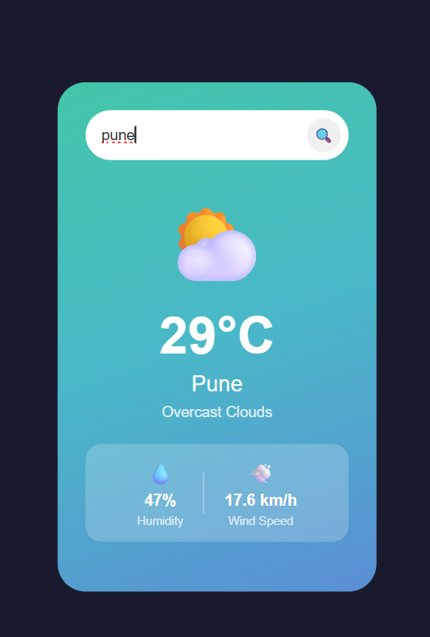

# 🌤️ Weather App

A simple weather app built using HTML, CSS, and JavaScript.

## Features
- Search any city in the world
- Shows current temperature in °C
- Shows weather condition with emoji
- Shows humidity and wind speed

## Technologies Used
- HTML
- CSS
- JavaScript
- OpenWeatherMap API

## How to Use
1. Type any city name in the search box
2. Press Search or hit Enter
3. See the weather instantly

## Live Demo
[Click here to view the app](https://sudarshan-murade.github.io/weather-app)

## Screenshot
